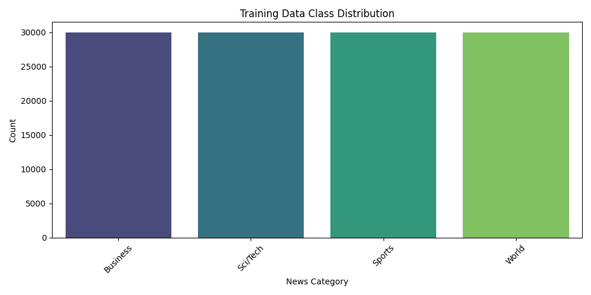
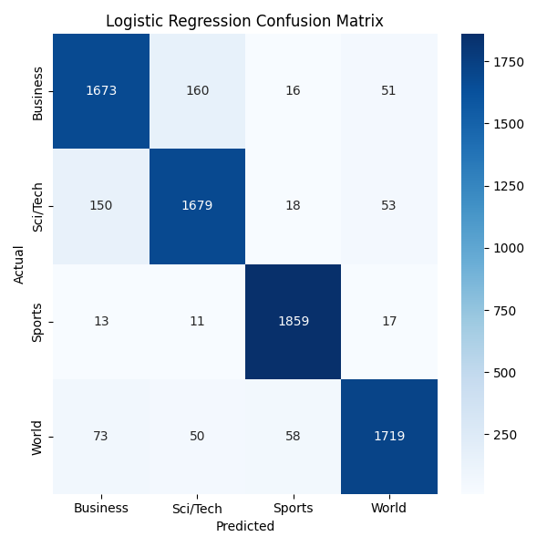
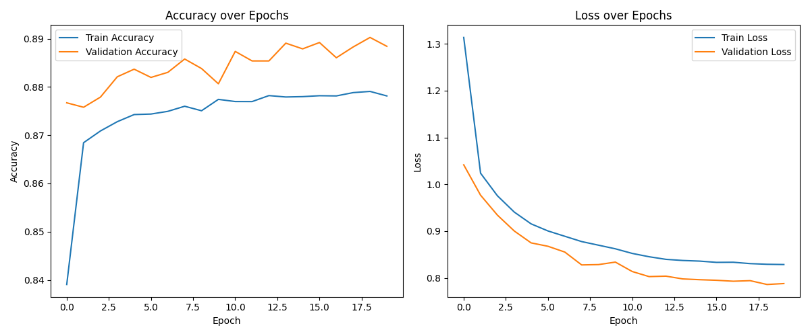
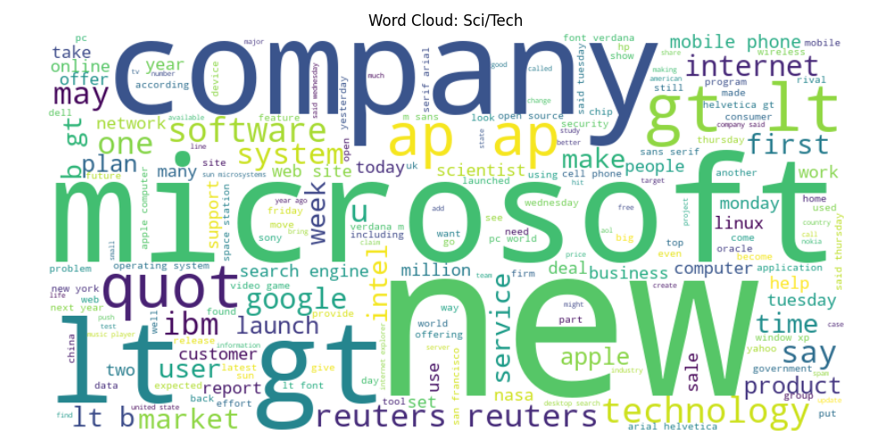
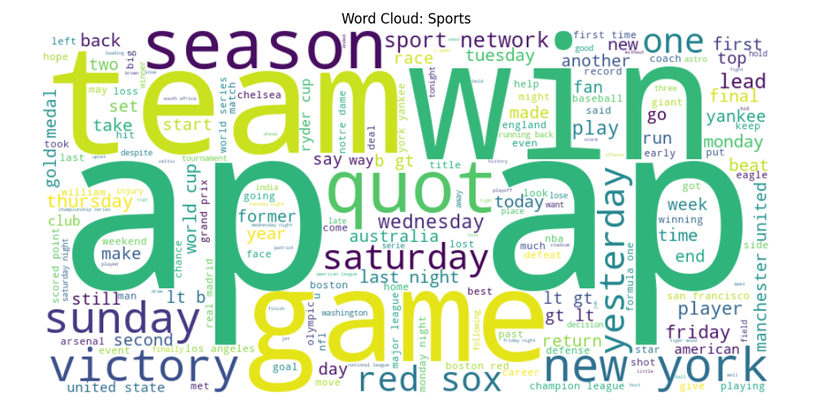
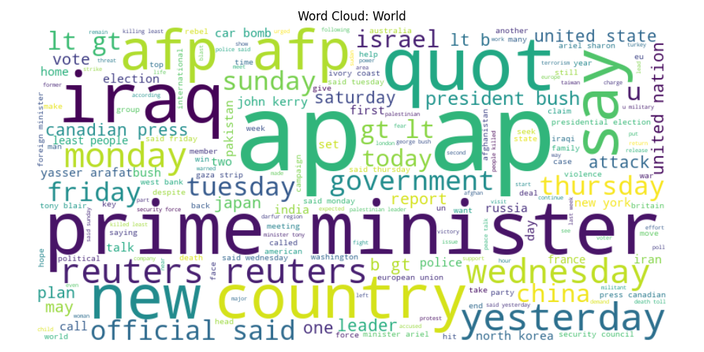

# News Category Classification

This project classifies news articles into four categories — World, Sports, Business, and Sci/Tech — using the AG News dataset. It features text preprocessing, TF-IDF vectorization, and classification using Logistic Regression and a feedforward Neural Network.

---

## Features

- Text preprocessing: tokenization, stopword removal, lemmatization  
- TF-IDF vectorization for feature extraction  
- Classification using Logistic Regression and a feedforward Neural Network  
- Visualizations: class distribution and word clouds per category  
- Model evaluation with accuracy, classification report, and confusion matrix  

## Table of Contents

- [Project Overview](#project-overview)  
- [Dataset](#dataset)  
- [Installation](#installation)  
- [Usage](#usage)    
- [Models](#models)  
- [Results](#results)  
- [Visualizations](#visualizations)  
- [License](#license)  

---

## Project Overview

The goal is to build a classifier to predict the category of a news article based on its title and description.

- Data cleaning and preprocessing include tokenization, stopword removal, and lemmatization.
- Feature extraction using TF-IDF vectorization (uni-grams and bi-grams).
- Classification using:
  - Logistic Regression
  - Feedforward Neural Network with dropout and L2 regularization

---
 
## Dataset

The dataset consists of CSV files (`train.csv` and `test.csv`) with the following columns:

- `class_index`: Numeric class label (1 to 4)
- `title`: News article title
- `description`: News article description

Class mapping:

| class_index | category_name |
| ----------- | ------------- |
| 1           | World         |
| 2           | Sports        |
| 3           | Business      |
| 4           | Sci/Tech      |

---

## Installation

1. Clone the repository:

  ```bash
  git clone https://github.com/your-username/news-category-classification.git
  cd news-category-classification
  ```

2.(Optional) Create and activate a virtual environment:

  ```bash
  python -m venv venv
  # On Linux/macOS
  source venv/bin/activate
  # On Windows
  venv\Scripts\activate
  ```

3.Install the required packages directly with pip:
  ```bash
  pip install pandas numpy matplotlib seaborn wordcloud nltk scikit-learn tensorflow
  ```
---

## Usage

1. **Update the dataset file paths inside the Python script:**

Open the main script file (`main.py` or your script filename) and replace the following variables with the paths to your local dataset files:

```python
train_path = r"YOUR_LOCAL_PATH_TO_train.csv"
test_path = r"YOUR_LOCAL_PATH_TO_test.csv"
```
---

## Models

### Logistic Regression

- Trained with TF-IDF features (up to 10,000 features, uni-grams and bi-grams).
- Maximum iterations set to 1000.
- Uses `scikit-learn` implementation with a fixed random seed for reproducibility.

### Neural Network

- Input layer size matches TF-IDF feature size.
- Two hidden layers with 512 and 256 neurons respectively.
- Uses ReLU activation functions.
- Includes Dropout (0.5) and L2 regularization (0.01) to reduce overfitting.
- Output layer with softmax activation for multi-class classification.
- Optimizer: Adam.
- Loss: Sparse categorical crossentropy.
- Early stopping with patience of 3 epochs.

---

## Results

The models produced the following outputs and metrics:

1. **Class Distribution**



2. **Logistic Regression Accuracy**

_Accuracy and classification report printed in console._

3. **Logistic Regression Confusion Matrix**



4. **Neural Network Accuracy Over Epochs**

_Plots showing training and validation accuracy._

5. **Neural Network Training History**



6. **Successful Predictions**

_A sample of correctly predicted news categories (add your own examples here)._

7. **Word Cloud - Business**


8. **Word Cloud - Sci/Tech**



9. **Word Cloud - Sports**



10. **Word Cloud - World**



---

## Visualizations

- Bar plot for class distribution (`images/class_distribution.png`).
- Word clouds for each category (`images/wordcloud_<category>.png`).
- Confusion matrix heatmap for Logistic Regression (`images/logreg_confusion_matrix.png`).
- Neural network training accuracy and loss over epochs (`images/nn_training_history.png`).

All visualizations are saved automatically when you run the script.

---

## License

This project is licensed under the MIT License - see the [LICENSE](LICENSE) file for details.


